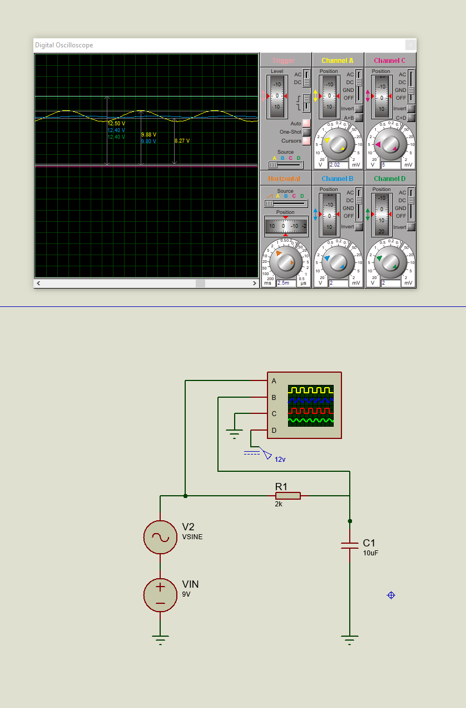
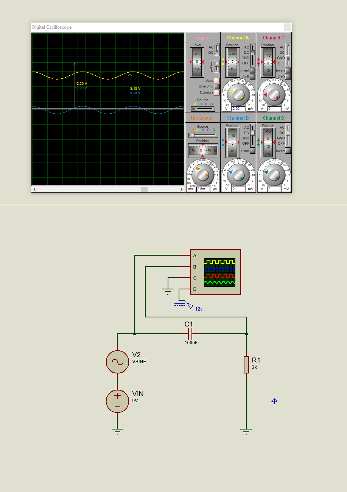

# Circuit Description and Simulation Instructions

## Overview
This document describes the design and functionality of the electronic circuit shown in the Proteus simulation. The circuit combines DC and AC voltage sources to demonstrate the behavior of a basic resistor-capacitor (RC) circuit. The design will later be extended to include a low-pass filter for additional analysis.

## Components
The circuit includes the following components:

1. **DC Voltage Source (VIN):**
   - Voltage: 9V
   - Purpose: Provides a constant DC offset to the circuit.

2. **AC Voltage Source (V2):**
   - Voltage: Sine wave with an amplitude of 3V.
   - Purpose: Adds a variable AC signal to the circuit for dynamic analysis.

3. **Resistor (R1):**
   - Value: 2 kΩ
   - Purpose: Controls the current flow and forms part of the RC network.

4. **Capacitor (C1):**
   - Value: 10 µF
   - Purpose: Stores and filters charge, affecting the circuit's response to the AC signal.

5. **Oscilloscope:**
   - Channels: A and B connected to different points in the circuit to observe voltage changes.
   - Purpose: Displays the combined AC and DC signal behavior at different points in the circuit.

6. **Voltage Indicator:**
   - Set at 12V.
   - Purpose: Provides a reference voltage or additional functionality based on the simulation's requirements.

## Current Functionality
This circuit demonstrates the interaction between AC and DC signals in an RC network. The output voltage is a combination of the DC offset from VIN and the AC signal from V2. Observations from the oscilloscope indicate the following:

1. The **DC offset** from VIN raises the baseline voltage.
2. The **AC component** introduces oscillations around the DC baseline.
3. The capacitor (C1) slightly filters the AC signal, smoothing rapid changes depending on the frequency of V2.

## Low-Pass Filter Configuration
### Updated Circuit:
This circuit has been updated to implement a low-pass filter configuration. The following changes were made:

1. **Capacitor (C1):**
   - Value increased to 100 µF to enhance the filtering effect for high-frequency components.

2. **Functionality:**
   - The low-pass filter attenuates high-frequency components of the AC signal, allowing low-frequency signals to pass through more effectively.

### Observations:
- The oscilloscope readings show the filtered signal with reduced high-frequency noise.
- The DC offset remains intact, while the AC component is smoothed.

### Updated Circuit Diagram:
#### High-Pass Filter:


#### Low-Pass Filter:


## Steps for Simulation
1. Open the Proteus schematic file.
2. Ensure all components are properly connected as shown in the updated diagram.
3. Run the simulation.
4. Observe the oscilloscope readings on Channels A and B to analyze the signal's characteristics (amplitude, frequency, and DC offset).
5. Adjust the AC source frequency or amplitude to see the low-pass filter's effect on the signal.

## Planned Updates
1. **Advanced Filtering Techniques:**
   - Implement a high-pass filter for comparison with the low-pass filter configuration.
   - Analyze and document the behavior of the combined filter setup.

2. **Readme Updates:**
   - Add detailed descriptions and new oscilloscope readings to showcase additional filtering stages.

## Key Formulas for Analysis
1. **Cutoff Frequency (ƒc):**
   ```markdown
   ƒ_c = 1 / (2 * π * R * C)
