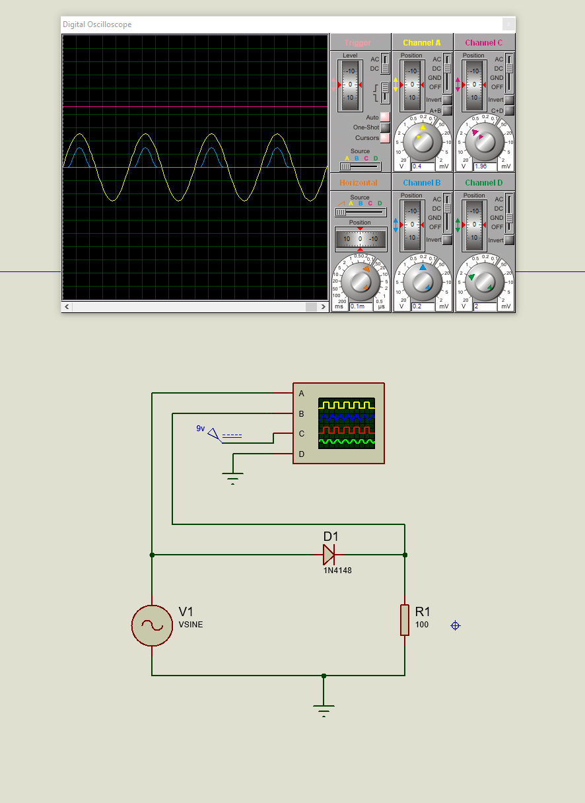

# Circuit Description and Simulation Instructions

## Overview
This document describes the design and functionality of the electronic circuit shown in the Proteus simulation. The circuit combines DC and AC voltage sources to demonstrate the behavior of various circuits, including rectifiers and filters.

### Half-Wave Rectifier Circuit

The first circuit demonstrates the rectification process using a single diode. The output is a pulsating DC waveform that only allows positive cycles of the AC signal to pass through.

---

### Filtered Half-Wave Rectifier

The second circuit extends the rectifier by adding a capacitor to smooth the output. This reduces ripple and produces a more stable DC output.

---

## Components

### Half-Wave Rectifier Components
1. **AC Voltage Source (V1):**
   - Voltage: 9V sine wave
   - Purpose: Provides the input signal to be rectified.

2. **Diode (D1):**
   - Type: 1N4148
   - Purpose: Allows only positive cycles of the AC signal to pass through, blocking the negative cycles.

3. **Resistor (R1):**
   - Value: 100 Ω
   - Purpose: Limits the current flowing in the circuit.

### Filtered Rectifier Components
1. **Capacitor (C1):**
   - Value: 100 µF
   - Purpose: Reduces ripple in the rectified signal, providing a smoother DC output.

---

## Observations

### Half-Wave Rectifier
- The oscilloscope shows a pulsating DC waveform with one polarity removed.
- The output follows the positive cycles of the AC signal, with the negative cycles blocked by the diode.

### Filtered Rectifier
- Adding a capacitor smooths the rectified waveform, reducing the ripple.
- The output is closer to a steady DC signal.

---

## Key Formulas for Rectifiers

1. **Ripple Voltage (Filtered Rectifier):**
   \[
   V_{ripple} = \frac{I}{f C}
   \]
   Where:
   - \( V_{ripple} \): Ripple voltage
   - \( I \): Load current
   - \( f \): Frequency of the AC signal
   - \( C \): Capacitance

---

## Steps for Simulation
1. Open the corresponding Proteus schematic file:
   - `Diod01.pdsprj` for the Half-Wave Rectifier
   - `Halfway_Rectifier.pdsprj` for the Filtered Rectifier
2. Ensure all components are properly connected as shown in the diagrams.
3. Run the simulation.
4. Observe the oscilloscope readings:
   - For the rectifier, verify the pulsating DC signal.
   - For the filtered rectifier, check for a smooth DC output.
5. Adjust the capacitance value to see how it impacts ripple reduction.

---

## Planned Updates
1. Add a full-wave rectifier circuit for comparison.
2. Explore advanced filtering techniques using LC and RC filters.
3. Document the effect of varying load resistance on ripple voltage.

---
