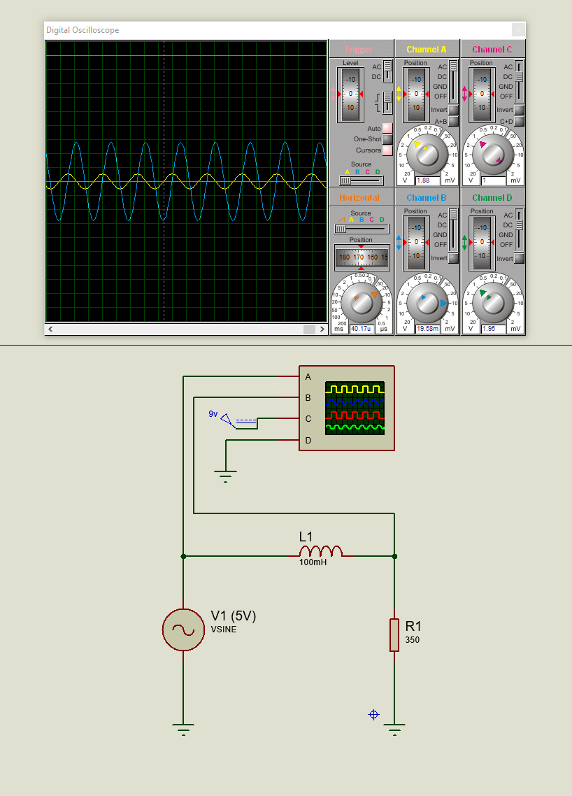

# Circuit Description and Simulation Instructions

## Overview
This document describes the design and functionality of the electronic circuit shown in the Proteus simulation. The circuit combines DC and AC voltage sources to demonstrate the behavior of a basic resistor-capacitor (RC) circuit and later extends to explore the characteristics of an inductor in an AC circuit.




## Components
The circuit includes the following components:

1. **DC Voltage Source (VIN):**
   - Voltage: 9V
   - Purpose: Provides a constant DC offset to the circuit.

2. **AC Voltage Source (V2):**
   - Voltage: Sine wave with an amplitude of 5V.
   - Purpose: Adds a variable AC signal to the circuit for dynamic analysis.

3. **Resistor (R1):**
   - Value: 350 Ω
   - Purpose: Controls the current flow and forms part of the RL (resistor-inductor) network.

4. **Inductor (L1):**
   - Value: 100 mH
   - Purpose: Opposes changes in current flow due to its inductive reactance, which varies with the frequency of the AC signal.

5. **Oscilloscope:**
   - Channels: A and B connected to different points in the circuit to observe voltage changes across components.
   - Purpose: Displays the behavior of the AC signal across the inductor and the resistor.

## Inductor Functionality
An inductor is a passive component that stores energy in its magnetic field when current flows through it. In an AC circuit, the inductor introduces **inductive reactance**, which depends on the frequency of the AC signal and the inductance value.

### Key Formula for Inductive Reactance
The inductive reactance (Ω) can be calculated as:

\[
X_L = 2 \pi f L
\]

Where:
- \( X_L \): Inductive reactance (in ohms)
- \( f \): Frequency of the AC signal (in hertz)
- \( L \): Inductance (in henries)

### Observations
1. **Low Frequencies:**
   - At lower frequencies, the inductive reactance is small, allowing more current to flow through the circuit.
2. **High Frequencies:**
   - At higher frequencies, the inductive reactance increases, reducing the current flow and creating a phase shift between the voltage and current.
3. **Phase Shift:**
   - The voltage across the inductor leads the current by 90 degrees in an ideal case.

## Current Functionality
This circuit demonstrates the interaction between an inductor and an AC signal. The oscilloscope readings provide insight into the following:

1. The **voltage drop** across the inductor (L1), which varies with the AC frequency.
2. The **current phase shift** introduced by the inductor.
3. The combined effect of the resistor and inductor in controlling the current flow.

## Steps for Simulation
1. Open the Proteus schematic file.
2. Ensure all components are properly connected as shown in the diagram.
3. Run the simulation.
4. Observe the oscilloscope readings on Channels A and B:
   - Channel A: Voltage across the inductor.
   - Channel B: Voltage across the resistor.
5. Adjust the frequency of the AC source to see how the inductor's behavior changes with frequency.

## Planned Updates
1. **Advanced RL Circuit Analysis:**
   - Add a capacitor to create an RLC circuit and analyze resonance.
   - Document the behavior of the circuit at the resonant frequency.
2. **Readme Updates:**
   - Add detailed descriptions and new oscilloscope readings for advanced circuits.

## Key Formulas for Analysis
1. **Inductive Reactance (X_L):**
   ```markdown
   X_L = 2 * π * f * L
