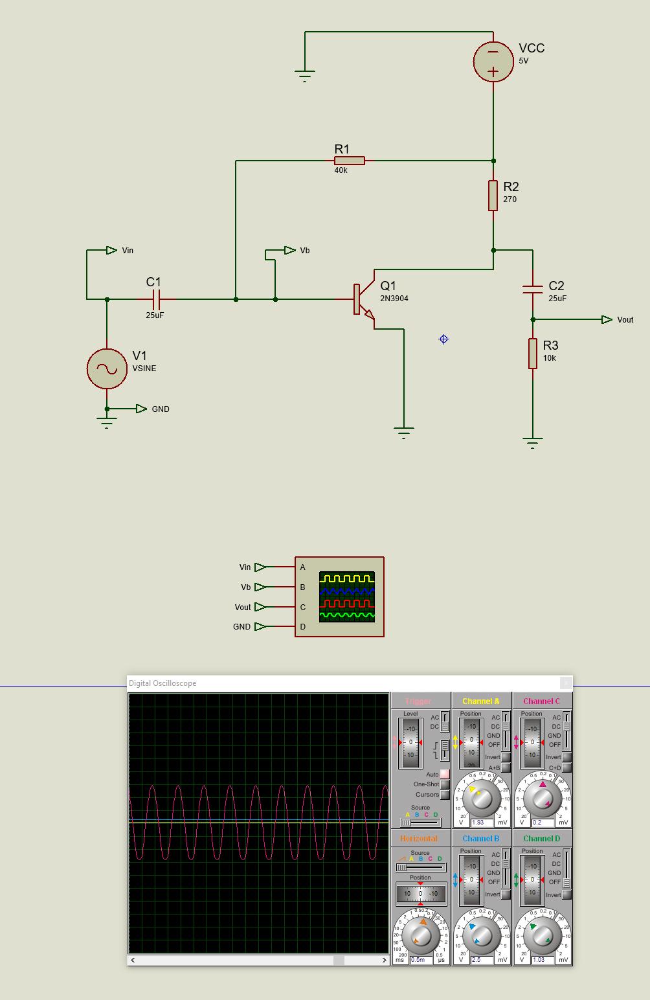

# Transistor Amplifier Circuit - Proteus Simulation

## Overview
This project demonstrates a simple **common-emitter transistor amplifier** circuit using a **2N3904 transistor**. The circuit amplifies an AC input signal and provides an amplified output at the collector. This README explains the circuit design, components, and simulation results.

---

## Circuit Components

1. **AC Voltage Source (V1):**
   - Type: Sine wave generator
   - Voltage: Adjustable amplitude
   - Purpose: Provides the input signal for amplification.

2. **Resistors:**
   - **R1 (40kΩ):** Provides the base bias current for the transistor.
   - **R2 (270Ω):** Limits the emitter current and stabilizes the operating point.
   - **R3 (10kΩ):** Acts as the load resistor, determining the output voltage.

3. **Capacitors:**
   - **C1 (25µF):** Couples the AC input signal to the base of the transistor while blocking DC components.
   - **C2 (25µF):** Couples the amplified output signal to the load while blocking DC components.

4. **Transistor (Q1):**
   - Model: 2N3904 (NPN)
   - Purpose: Amplifies the input signal by controlling the collector current based on the base current.

5. **DC Voltage Source (VCC):**
   - Voltage: 5V
   - Purpose: Provides power to the circuit.

6. **Oscilloscope:**
   - Channels:
     - **Channel A (Vin):** Displays the input signal.
     - **Channel B (Vb):** Shows the base voltage of the transistor.
     - **Channel C (Vout):** Displays the amplified output signal.
   - Purpose: Analyzes the input, base, and output waveforms.

---

## How the Circuit Works

1. **Input Signal (Vin):**
   - An AC signal is applied to the base of the transistor through the coupling capacitor (C1). 
   - The capacitor blocks any DC component, ensuring only the AC signal reaches the transistor.

2. **Amplification:**
   - The transistor amplifies the small input signal.
   - Proper biasing using R1 and R2 ensures the transistor operates in the active region.

3. **Output Signal (Vout):**
   - The amplified signal is available at the collector of the transistor.
   - The output is coupled to the load resistor (R3) through the coupling capacitor (C2), which blocks DC and passes only the amplified AC signal.

---

## Observations

1. **Input vs. Output:**
   - The input signal (Vin) has a smaller amplitude compared to the amplified output (Vout).
   - The base voltage (Vb) is properly biased to ensure stable operation.

2. **Amplified Signal:**
   - The oscilloscope shows an amplified signal at the output (Vout) with minimal distortion.

---

## Key Formula

### Voltage Gain:
The voltage gain of the circuit can be calculated as:
\[
A_v = \frac{R3}{R2}
\]
Where:
- \( A_v \): Voltage gain
- \( R3 \): Load resistor
- \( R2 \): Emitter resistor

### Cutoff Frequency:
The cutoff frequency of the coupling capacitors can be determined using:
\[
f_c = \frac{1}{2 \pi R C}
\]
Where:
- \( f_c \): Cutoff frequency
- \( R \): Resistance
- \( C \): Capacitance

---

## Steps for Simulation

1. Open the provided Proteus schematic file.
2. Ensure all components are properly connected as shown in the diagram.
3. Run the simulation.
4. Use the oscilloscope to observe:
   - **Channel A (Vin):** Input signal.
   - **Channel B (Vb):** Base voltage.
   - **Channel C (Vout):** Amplified output signal.
5. Adjust the input signal amplitude or frequency to analyze the circuit's behavior.

---

## Planned Updates

1. Add a frequency response analysis to observe the behavior at different frequencies.
2. Implement a feedback network to improve the stability of the amplifier.
3. Add a more detailed analysis of phase shift and distortion.

---

