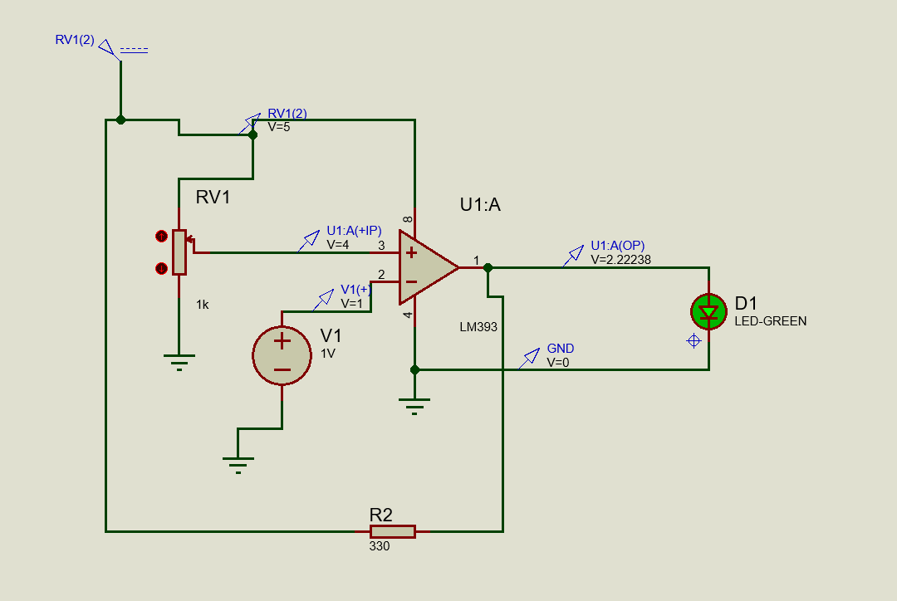

# LM393 Light Detection Comparator Circuit

This project demonstrates a basic light detection circuit using an LM393 comparator. The circuit compares a reference voltage with a simulated light-dependent voltage to switch an LED on or off.

## 🔧 Components Used

| Component        | Value       | Purpose                           |
|------------------|-------------|------------------------------------|
| LM393            | Dual Comparator | Core comparator logic             |
| Potentiometer    | 1kΩ         | Acts as a variable reference voltage (Vref) |
| DC Voltage Source| 1V          | Simulates input from a solar cell (Vin) |
| Resistor R2      | 330Ω        | Current limiting resistor for the LED |
| LED              | Green       | Output indicator (on in dark / Vin < Vref) |
| Vcc              | 5V          | Power supply for LM393             |
| GND              | -           | Ground reference                   |

## ⚙️ How It Works

- Non-inverting input (+) of LM393 is connected to the output of the potentiometer (adjustable Vref).
- Inverting input (−) is connected to a fixed DC voltage source (simulating solar/light sensor).
- Output goes LOW when Vin > Vref → LED turns off.
- Output goes HIGH (via pull-up inside LM393 or external resistor) when Vin < Vref → LED turns on.

## 🧪 Simulation Notes

- This schematic assumes:
  - Pull-up mechanism is handled internally or by LED path.
  - The voltage difference between V+ and V− determines the output.

| Condition         | LED State |
|-------------------|-----------|
| Vin (−) > Vref (+)| OFF       |
| Vin (−) < Vref (+)| ON        |

## 📌 Applications

- Solar light controllers (auto ON in dark)
- Light-sensitive switch circuits
- Comparator-based control logic

## 💡 Notes

- To simulate real-world behavior, replace the fixed voltage (V1) with a solar cell.
- Add a pull-up resistor (e.g., 10kΩ) to the comparator output for reliable switching, if not already present through the LED path.

