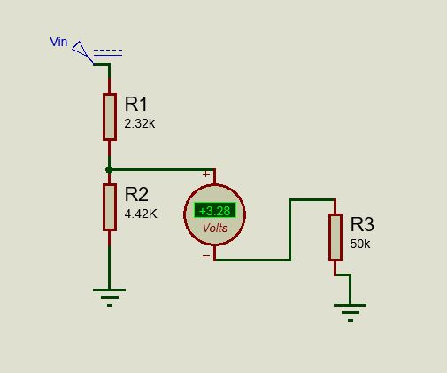

# Voltage Divider

This project demonstrates a voltage divider circuit using two resistors to provide a 3.3V output suitable for a Raspberry Pi port, which requires 3.3V voltage and 1mA current.

## Overview

A voltage divider is a simple circuit that turns a large voltage into a smaller one. Using two resistors in series, the voltage is divided between them. This project uses this principle to create a 3.3V output from a higher voltage source.

## Circuit Diagram

## Components

- Resistor R1
- Resistor R2
- Voltage source

## Calculation

To achieve the desired 3.3V output, the resistors should be chosen based on the following formula:

\[ V_{out} = V_{in} \times \frac{R2}{R1 + R2} \]

Where:
- \( V_{out} \) is the output voltage (3.3V)
- \( V_{in} \) is the input voltage
- \( R1 \) and \( R2 \) are the resistors

For example, if the input voltage is 5V, you can choose R1 and R2 such that the ratio \( \frac{R2}{R1 + R2} \) equals 0.66.

## Usage

1. Connect the resistors in series.
2. Connect the input voltage to the series combination.
3. Measure the output voltage across the second resistor (R2).

## Notes

- Ensure the resistors can handle the power dissipation.
- Verify the output voltage with a multimeter before connecting to the Raspberry Pi.

## License

This project is licensed under the MIT License.